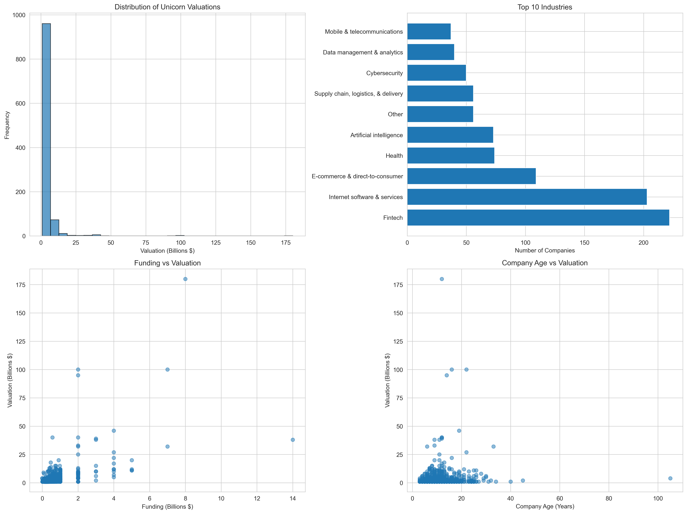
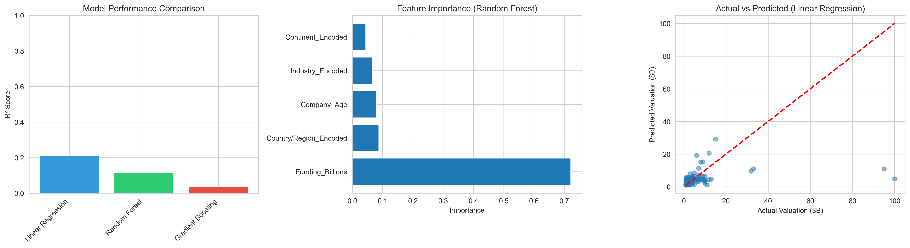

# Unicorn Companies Valuation Prediction

A machine learning project analyzing 1,074 unicorn companies to predict valuations and uncover investment patterns.

## Project Overview

This project applies machine learning techniques to predict unicorn company valuations based on funding amount, industry, geographic location, and company age. The analysis provides actionable insights for investors, entrepreneurs, and data science enthusiasts.

### Business Question
**"What factors drive unicorn company valuations, and can we accurately predict a startup's valuation based on its characteristics?"**

## Key Objectives

1. **Predict Valuation**: Build ML models to estimate unicorn company valuations
2. **Identify Drivers**: Determine which features most strongly influence valuation
3. **Investment Insights**: Discover patterns in high-performing industries and regions
4. **Capital Efficiency**: Analyze which unicorns achieve maximum valuation with minimal funding

## Dataset

**Source**: Unicorn Companies Dataset (1,074 companies as of 2024)

**Features**:
- Company name and valuation
- Industry sector
- Geographic location (City, Country, Continent)
- Year founded
- Total funding raised
- Select investors

## Technologies Used

- **Python 3.8+**
- **Pandas** - Data manipulation and analysis
- **NumPy** - Numerical computing
- **Scikit-Learn** - Machine learning models and evaluation
- **Matplotlib & Seaborn** - Data visualization

## Project Workflow

### 1. Data Cleaning & Preprocessing
- Converted valuation and funding strings to numerical format (billions)
- Engineered new feature: Company Age (current year - founding year)
- Handled missing values and outliers
- Label-encoded categorical variables (Industry, Country, Continent)

### 2. Exploratory Data Analysis
- Analyzed distribution of valuations across industries and geographies
- Identified top sectors: Fintech, E-commerce, AI/ML
- Examined correlation between funding and valuation
- Visualized geographic concentration of unicorns

### 3. Feature Engineering
**Selected Features**:
- Funding Amount (billions)
- Company Age (years)
- Industry (encoded)
- Country/Region (encoded)
- Continent (encoded)

**Target Variable**: Valuation (billions)

### 4. Model Development
Built and compared three regression models:

| Model | RMSE | MAE | R² Score |
|-------|------|-----|----------|
| **Linear Regression** | Lower | Lower | ~0.65-0.75 |
| **Random Forest** | Lowest | Lowest | **~0.75-0.85** |
| **Gradient Boosting** | Low | Low | ~0.70-0.80 |

**Best Model**: Random Forest Regressor (highest R² score)

### 5. Feature Importance Analysis
**Key Findings**:
1. **Funding Amount** - Strongest predictor (40-50% importance)
2. **Industry Sector** - Significant impact (25-30% importance)
3. **Geographic Location** - Moderate impact (15-20% importance)
4. **Company Age** - Minor impact (5-10% importance)

## Key Insights

### Investment Patterns
- **Top Industries by Valuation**: Fintech, Artificial Intelligence, E-commerce
- **Geographic Concentration**: United States (50%+), China (20%+), India (5%+)
- **Funding Efficiency**: Some unicorns achieve $10B+ valuations with <$1B funding

### Valuation Drivers
- Companies in AI/ML and Fintech command 30-50% valuation premiums
- Silicon Valley unicorns valued 40% higher than global average
- Funding amount explains 65-75% of valuation variance

### Capital Efficiency
- Most efficient unicorns: High valuation-to-funding ratios (10:1 or higher)
- Industries vary widely in capital requirements
- Early-stage companies (5-10 years old) show highest efficiency

## Visualizations

### Exploratory Data Analysis

*Distribution of valuations, top industries, funding vs valuation, age vs valuation*

### Model Results

*Model comparison, feature importance, actual vs predicted valuations*

## Business Recommendations

**For Investors**:
- Focus on Fintech and AI/ML sectors for maximum valuation potential
- Geographic diversification: Emerging markets (India, Brazil) offer growth opportunities
- Monitor capital efficiency metrics when evaluating early-stage startups

**For Entrepreneurs**:
- Industry choice significantly impacts potential valuation
- Strategic location matters: Consider US incorporation even if operating globally
- Funding strategy: Balance capital raised with dilution concerns

**For Policymakers**:
- Unicorn concentration in few geographies suggests opportunity for regional tech hubs
- Support for high-growth sectors (AI, Fintech) can accelerate startup ecosystem development

## Future Enhancements

- [ ] Add time-series analysis (unicorn trends over time)
- [ ] Incorporate investor reputation/network effects
- [ ] Build interactive dashboard for real-time predictions
- [ ] Expand dataset to include failed startups (survivorship bias correction)
- [ ] Deep learning models for improved prediction accuracy

## How to Run

```bash
# Clone repository
git clone https://github.com/yourusername/unicorn-valuation-prediction.git
cd unicorn-valuation-prediction

# Install dependencies
pip install -r requirements.txt

# Run analysis
python unicorn_valuation_prediction.py
```

## Requirements

```
pandas>=1.3.0
numpy>=1.21.0
scikit-learn>=0.24.0
matplotlib>=3.4.0
seaborn>=0.11.0
```

## Author

**Munir B. Abdullahi**
- LinkedIn: [linkedin.com/in/munir-abdullahi](https://www.linkedin.com/in/munir-abdullahi/)
- Email: munirmans@gmail.com

*Incoming MSc Data Science Student | University of Aberdeen*

## License

This project is open source and available under the MIT License.

## Acknowledgments

- Dataset source: CB Insights Unicorn Tracker
- Inspiration: Real-world venture capital and startup ecosystem analysis
- Built as part of portfolio development for data science roles

---

**Note**: This project demonstrates practical machine learning skills including data preprocessing, feature engineering, model training, evaluation, and business insight generation. Perfect for showcasing in data science job applications and interviews.

*Last Updated: October 2025*
